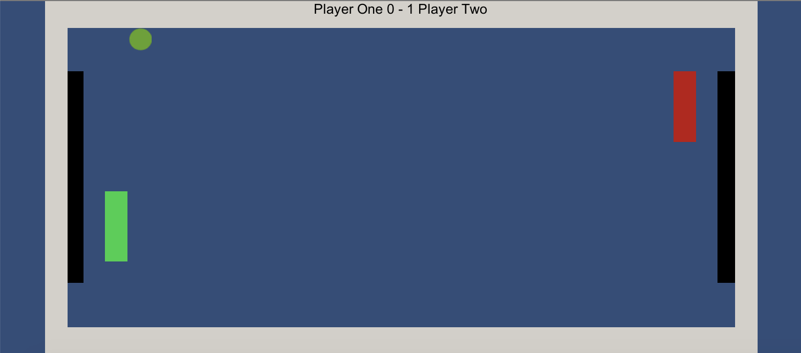

# PongGame
A classic local 2 player pong game made in Unity!
Player 1 uses the "Q" and "A" keys to control their paddel.
Player 2 use the "O" and "L" keys to control their paddel.

To score a point the player must hit the ball into the other players goal, indicated by a black box.

Scores are tracked at the top, first player to 3 points wins!

# Demo Content

## Start Menu

## Gameplay

## Game Over

